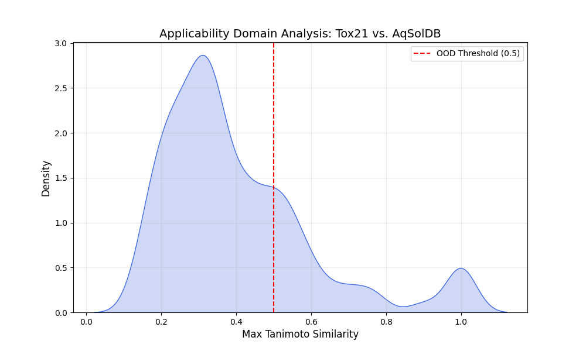

# Chemical-OOD-Analyzer
Out-of-Distribution (OOD) analysis for chemical datasets using Tanimoto Similarity and RDKit.
# Chemical Out-of-Distribution (OOD) Analyzer

## Project Overview
This tool quantifies the **Applicability Domain** of Machine Learning models in chemical discovery. In data-scarce (Low-Data) regimes, predictive models often encounter molecules structurally distinct from their training sets. This script identifies "Out-of-Distribution" (OOD) molecules to prevent unreliable "black-box" predictions.

## Technical Approach
- **Featurization:** Morgan Fingerprints (2048-bit) via RDKit.
- **Metric:** Tanimoto Similarity.
- **Goal:** For each test molecule, calculate the maximum similarity to any molecule in the reference (training) set.

## Key Results

The analysis flags molecules with a Max Tanimoto Similarity below **0.5** as "structural outliers." This diagnostic is critical for robust autonomous discovery pipelines as pursued in the **LowDataML Network**.

## How to Run
1. Install dependencies: `pip install rdkit pandas matplotlib seaborn`
2. Run the script: `ood_analyzer.py.py`
